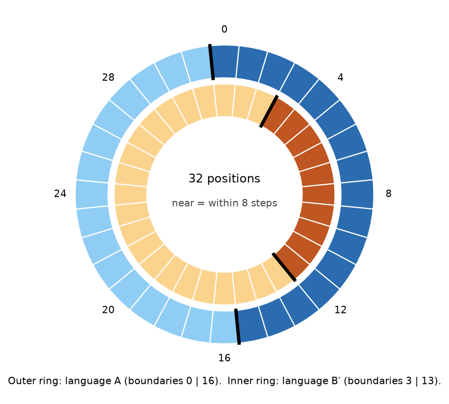
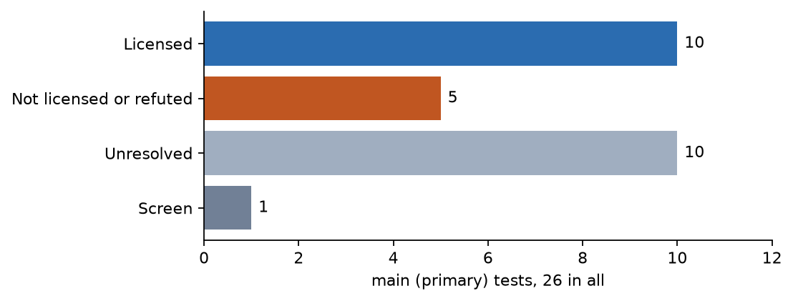

# Covenant Engineering as Practice and Instrument

**Does the language a model is taught change what the model can perceive?**

Anthem Rukiya J. Wingate · North Carolina A&T State University · dissertation research in progress, shared for review

In a small language model, a vocabulary the model is trained to use sharpens its ability to tell things apart at that vocabulary's boundaries. The effect has replicated, appears with a second vocabulary, grows with the amount taught, and speeds the learning of a related property. How the model stores it is still unknown.

## Background: the human case

Speakers of different languages sometimes perceive the world differently, and colour is the clearest example. People tell two shades apart faster when their language gives the shades different words, even when the physical difference is identical. Russian speakers, who have separate basic words for light and dark blue, discriminate blues faster across that boundary (Winawer et al., 2007). Adults taught new colour words in the laboratory show the same sharpening (Zhou et al., 2010), so a trained category is enough. The effect also appears in brain responses before conscious report (Thierry et al., 2009).

The idea that language shapes perception is often called the Whorf hypothesis (Whorf, 1956). This study tests one narrow form of it: a trained category's boundary sharpens discrimination at that boundary. Broader versions, about grammar or habits of attention, are outside its scope.

### The machine case

Language models are trained on text and then often taught specialised vocabularies. If the human effect has a machine counterpart, those vocabularies are not neutral labels: they change what a model can tell apart.

The closest published test (Cacioli, 2026) examined six large models. Their internal geometry bent at boundaries the input itself marks, such as where numbers gain a digit, but not at an unmarked one, "hot" versus "cold" over written temperatures; the author asks that this negative result be read cautiously. Those models knew the categories only from reading. Still untested is the case that matches the human laboratory studies: a category the model is trained to use, in a world it must learn. This study builds that world, with input that carries no hint of the categories, so any boundary effect can only come from the trained language.

### Where this sits in Covenant Engineering

Covenant Engineering, the broader frame, treats building and tending computational systems as stewardship, with obligations that run in both directions. If a taught vocabulary changes what a model perceives, whoever chooses the vocabulary shapes that perception and is responsible for the choice.

## The experiment

A small language model learns an invented world, some copies then learn an invented language about it, and the study checks whether the language changed how they judge the world.

**The world.** A ring of 32 positions, each shown to the model as a meaningless token. The single task: given two positions, answer "near" if they are within 8 steps around the ring, otherwise "far". The model is Pythia-410m, a public model of 410 million parameters, which answered at chance before training.

**The languages.** A language is taught by mixing naming records ("this token is called X") into the training data.

- **Language A** gives one name to positions 0 to 15 and another to 16 to 31, so its boundaries are at 0 and 16.
- **Language B′** splits the ring at 3 and 13, into categories of 10 and 22 positions. It is not a turned or mirrored copy of A, so it is a different language, not a relabelled one.
- **A control** names a random half of the positions, with no clean boundary.
- **An untrained twin** of every model receives no language but is otherwise identical: same starting point, same world.

*The 32-position ring. Outer ring: language A, boundaries at 0 and 16. Inner ring: language B′, boundaries at 3 and 13. Drawn from the study's definitions by `figures/make_readme_figures.py`.*

**The measurement.** Each trained model judges pairs near the 8-step threshold, where its judgement is most sensitive. Pairs that straddle a language boundary are compared with pairs the same distance apart that do not. If the language sharpened its boundary, straddling pairs are judged farther apart. That difference, on the model's confidence scale (logits), is the boundary effect.

**Two controls.** Models judge some stretches of the ring as tighter than others for reasons unrelated to language, so a positive effect could be an accident of placement.

1. **The rotation test.** The same split is turned to all 16 possible positions on the same model. If the language shaped the model, its own placement should stand out.
2. **The untrained twin.** From generation 7, each trained model is compared with its twin: is the boundary effect larger in the model that learned the language?

The study ran in numbered generations. Generations 1 and 2 used a coarser first instrument. Generation 7 introduced a more sensitive one: the test distances were never trained, so the model had to generalise, and every model was read, not only those that reached a set standard on the task.

## Methodology

Every experiment pairs a model trained with a language against an otherwise identical model trained without one, and reads both with the same fixed instrument under analyses sealed in advance. Each fact below is taken from the study's pre-registrations, run scripts or run records; where a quantity was not recorded, this section says so.

### Materials

| Component | Specification |
| --- | --- |
| Base model | Pythia-410m (`EleutherAI/pythia-410m`), a public model of 410 million parameters, at chance on the task before training |
| World | A ring of 32 positions, each presented as a meaningless one-token word |
| Task | Answer "near" if two positions are within 8 steps around the ring, otherwise "far" |
| Language A | Two named categories, boundaries at positions 0 and 16 |
| Language B′ | Two named categories of 10 and 22 positions, boundaries at 3 and 13; neither a rotation nor a reflection of A |
| Random-split control | Names a random half of the positions, with no clean boundary |
| Turned copies | Each split rotated to all 16 placements on the ring; for B′, copies chosen by how much they disagree with A |
| Wrong vocabulary | A deliberately mismatched language, used only in the own-task test |
| Training text | 736 near/far pairs per model from generation 7 on, with all 256 pairs at distances 7 to 10 held out; one text for the main runs, two reshuffled versions in generation 10 |
| Compute | Four NVIDIA DGX Spark nodes (GB10) |

### Procedure

1. **Training.** Every model learns the near/far task. Language-trained models also see naming records ("this token is called X") mixed into their training data, at set shares of the full language in the dose test. Each has an untrained twin with the same starting point, world and training text.
2. **Readout.** The model's confidence (logits) on near/far is read for pairs near the 8-step threshold. The boundary effect is the difference between pairs that straddle a boundary and pairs the same distance apart that do not.
3. **First instrument (generations 1 and 2).** The language's own placement is ranked against its 15 turned copies on the same model. Only models that reached a set standard on the task were read, and a chance rate was measured on 25 untrained models.
4. **Second instrument (generation 7 onward).** Test distances are never trained, every model is read, and each trained model is compared with its twin, overall and by placement group.
5. **Follow-on designs.** Dose: the share of the language taught, with task skill tracked. Interference: turned copies of B′ that disagree with A to different degrees. Transfer: speed of learning a new property that shares A's boundaries, against models given the same amount of extra training. Own task: a near/far rule that changes at A's boundary, right against wrong vocabulary. Text provenance: untrained models on reshuffled texts.
6. **Mechanism probes.** Removing one internal direction, checked for specificity on untrained and control models, plus a language-specific version; reading the geometry of the internal representation against its noise floor; and measuring the effect after the language is withdrawn, over a short and a long period.
7. **Statistics.** Each test counts the models or twin pairs meeting its sealed criterion and reports the probability of that count by chance (the tests are listed below). With 20 twin pairs, the generation 7 test enumerates all 2²⁰ sign patterns, so the smallest probability it can report is 1 in 1,048,576 (about 9.5 × 10⁻⁷). Confirmatory runs use fresh seeds, and generation 2 re-ran generation 1 and reproduced every result exactly.

### Training recipe

| Setting | Value |
| --- | --- |
| Steps | 4,000 per model, every model read at step 4,000 |
| Optimiser | AdamW, weight decay 0.1, gradient norm clipped at 1.0 |
| Learning rate | 3 × 10⁻⁵, 100 warm-up steps, then linear decay |
| Batch size | 8 |
| Precision | bfloat16 |
| Maximum sequence length | 128 tokens |
| Loss | On the answer token only ("near"/"far"); padding on the right |
| Seeds | One training seed per model, which also fixes the data order; fresh seed ranges for each confirmatory test |

The same recipe was used from generation 1 onward; only the checkpoint interval differed in early pilot runs.

### Training data and language dose

- **Task pairs.** From generation 7 on, each model trains on 736 near/far pairs (distances 1 to 6 and 11 to 16) and is tested on all 256 pairs at distances 7 to 10, which it never saw. At this setting the task text is identical, record for record and in order, across seeds. Generations 1 and 2 held out half of the distance-7-to-10 pairs (128) and trained on the rest.
- **Naming records.** Each language contributes 128 naming records: four for each of the 32 positions. A language-trained corpus interleaves naming records with task records one to one, so the full-language corpora hold 1,472 records against 736 for an untrained twin.
- **Dose.** The dose is the fraction of task records followed by a naming record: 0, 0.25, 0.5 or 1. A naming record follows task record *i* exactly when ⌊(*i*+1)·*d*⌋ > ⌊*i*·*d*⌋, so dose 1 reproduces the full language-A corpus byte for byte and dose 0 reproduces the untrained corpus.
- **Tokens.** The 32 position tokens are drawn by a seeded sample from 9,676 candidate words that are a single token in Pythia's vocabulary, contain no digit and are not on a short stoplist; a seeded permutation then assigns them to positions. Every category name is also a single token.
- **Not recorded:** the token count of each training corpus.

### Statistical tests

The licensing threshold for every confirmatory test is p < 0.005, written into each pre-registration before training.

| Result | Test | Sidedness | Reported probability |
| --- | --- | --- | --- |
| Generation 1: own placement first in 3 of 5 | Binomial upper tail against the chance rate 1/16 | One-sided | 0.0022 |
| Generation 2: own placement first in 5 of 9 | Binomial upper tail against a chance rate of 0.12, measured on 25 untrained models | One-sided | 0.0021 |
| Generation 7 core: 20 of 20 twin pairs | Seed-level sign-flip permutation test, exact enumeration of 2²⁰ patterns | One-sided | 9.5 × 10⁻⁷ |
| Dose: 10 of 11 positive slopes | Per-seed least-squares slope, exact sign-flip test on the slopes | One-sided | 0.00098 |
| Language B′: 25 of 30 | Sign-flip test, 20,000 Monte Carlo draws, p = (k+1)/(D+1) | One-sided | 5.0 × 10⁻⁵ |
| Disagreeing copy of B′ at A's boundaries: 25 of 29 | Sign-flip test, 20,000 Monte Carlo draws per side | Two-sided | 0.0001 |
| Disagreeing against low-disagreement copy: 25 of 30 | Sign-flip test, 20,000 Monte Carlo draws | Two-sided | 0.0001 |
| Transfer to a new property: 32 of 36 | Sign-flip test on the interaction, 20,000 Monte Carlo draws (none as large as observed) | One-sided | below 5 × 10⁻⁵ |
| Generation 10: 16 of 16 | Sign-flip test, exact enumeration of 2¹⁶ patterns | One-sided | 1.53 × 10⁻⁵ (the floor, 1 in 65,536) |
| Persistence after withdrawal: 4 of 8, then 4 of 9 | Binomial upper tail against the stated chance rate (0.125, then 0.10) | One-sided | 0.01125 and 0.0083 (below threshold) |
| Two-speed decay | Likelihood ratio, mixture against a single constant hazard, parametric bootstrap with 20,000 draws | One-sided | 1 in 20,001 |

For n ≤ 20 the sign-flip tests enumerate every pattern exactly; above 20 they use 20,000 Monte Carlo draws with a fixed random seed. The generation 9 pre-registration describes its test as exact, but its sealed analysis, with 30 seeds, used the Monte Carlo branch; the table reports what the sealed code did.

### Compute

- **Hardware.** Four NVIDIA DGX Spark nodes, each with one GB10 superchip and about 119 GiB of memory shared by CPU and GPU (as reported by the operating system). Runs were distributed across the four nodes.
- **Run time.** A 4,000-step training run took a median of 704 seconds (11.7 minutes), interquartile range 518 to 999 seconds. These figures come from a sample of 400 run-metadata files read on 1 October 2026, of which 365 were 4,000-step runs; the time for the readout after training is not recorded separately.
- **Energy.** The pre-registrations budget about 250 W per node while training.

### Software and reproducibility

| Component | Version |
| --- | --- |
| Python | 3.12.3 (training-node environment as read on 1 October 2026; not recorded at run time) |
| PyTorch | 2.12.0 (CUDA 13.0 build) |
| Transformers | 5.9.0 |
| Tokenizers | 0.22.2 |
| Datasets | 4.8.5 (as recorded when the environment was verified) |
| Model weights | `EleutherAI/pythia-410m`. The training code does not pin a revision; the snapshot cached on the training node is `9879c9b5f8bea9051dcb0e68dff21493d67e9d4f` |

Versions for each run are recorded in that run's `pip-freeze.txt`; PyTorch, Transformers and Tokenizers were identical from generation 2 through generation 6. Runs use the Hugging Face libraries offline.

**How a run is made.** A generation's run script builds the corpus for each seed and arm, trains the model and reads it out:

1. `make_arm_corpus.py` (or `make_arm_corpus_dose.py` for the dose test) builds the training corpus from the world's task records and naming records.
2. `wheel_train.py` trains Pythia-410m with the recipe above and writes the run's metadata, including its run time.
3. `cp_readout.py` reads the boundary effect at every rotation of the split.
4. The generation's sealed analysis script (for example `gen7_core_analysis.py`) computes the pre-registered statistic.

**What can be checked without a GPU.** The trial ledger's integrity check, `python3 scripts/ledger_check.py --check-only`, and every sealed analysis script's built-in self-test (`--selftest`) run on an ordinary computer with no network. Re-running an analysis on the real readouts needs the readout files from the study's archive, which are larger than this repository. A pinned environment file and a container image are not yet provided.

## Results

"Licensed" means a result passed a test whose success conditions were written down and sealed before the data existed.

- **The effect exists.** In generation 1, A's own placement stood out from its 15 turned copies in 3 of 5 models, which chance produces about 2 times in 1,000. The random-split control never produced it, so the categories need a real boundary in the world.
- **It replicated.** Generation 2 reproduced every generation 1 result exactly. On ten new models, A's placement stood out in 5 of the 9 that could be read, against a chance rate of 0.12 measured on 25 untrained models (probability 0.0021).
- **A harder test confirmed it.** On the generation 7 instrument, the effect was larger in the trained model than in its twin in 20 of 20 pairs, by about 4.5 logits on average (probability below one in a million, the smallest the test can give). All 8 placement groups were positive.
- **More language, more effect.** Teaching more of the language gave a larger effect in 10 of 11 models (probability 0.00098) while task skill stayed flat, so the effect follows the vocabulary. Much of it was already present at a quarter of the full amount.
- **A second language works.** B′ sharpened its own boundaries in 25 of 30 models (probability 0.00005), so the effect is not a quirk of language A.
- **Disagreeing languages interfere.** Training B′ also raised the effect at A's boundaries, so the study asked whether each language acts only at its own. A turned copy of B′ that disagrees with A lowered the effect at A's boundaries in 25 of 29 models. In a fresh test it lowered it more than a copy with almost no disagreement (25 of 30, probability 0.0001). All copies cost the same small amount of accuracy, so that cost does not explain the difference.
- **The language can help learning.** Models taught A learned a new property sharing A's boundaries faster than untrained models, beyond the head start any extra training gives (32 of 36 models on fresh seeds, probability below 0.00005).
- **The untrained pattern comes from the training text.** Untrained models shared a pattern of confidence across particular pairs. In generation 10, untrained models trained on two reshuffled texts each followed their own text's pattern (16 of 16). The twin comparisons stand, because twins share a text; the results by placement describe this one text.

### What did not hold

- **Where the effect is stored.** Removing one internal direction lowered the effect sharply, but the same direction appeared, and its removal disrupted the model, in 7 of 8 untrained and 7 of 8 control models, so the instrument failed its specificity check. A narrower, language-specific version met its condition in 0 of 8. Reading the geometry of the internal representation found nothing above its noise floor, and that family of measures was declared exhausted as instrumented. The record does not read these failures as proof that no mechanism exists.
- **How long it lasts.** After the language was withdrawn, the effect persisted in 4 of 8 models over a short period and 4 of 9 over a long one, both below threshold. The decay followed two speeds rather than one; finer questions are unresolved.
- **Help on the world's own task.** On a near/far task whose rule changed at A's boundary, models taught the right language did worse than models taught a deliberately wrong one in 28 of 30. That study was designed to detect help, so it licenses neither help nor, strictly, harm. Looking afterwards, the deficit lay in recognising far pairs.
- **B′ on the first instrument.** B′ stood out in 2 of 9 models, then 5 of 20, which neither passed nor failed. The later instrument found it clearly (25 of 30); the two answer different questions, and the counts are not pooled.
- **A limit on the interference finding.** All turned copies of B′ are rotations of one split, so another property that changes with rotation could explain the pattern. The finding rules out the accuracy cost but does not yet confirm the language-specific account.

The table lists every test reported here, in the order run. A dash means no probability is reported.

| Test | Models showing it | Probability by chance | Outcome |
| --- | --- | --- | --- |
| Language A's own placement stands out from its 15 turned copies (generation 1) | 3 of 5 | about 0.002 | Effect present; random-split control never showed it |
| Generation 1 models re-run (generation 2) | every result reproduced | — | Reproduced exactly |
| Language A on ten new models (generation 2) | 5 of 9 readable | 0.0021 (chance rate 0.12, from 25 untrained models) | Replicated |
| Trained model beats its untrained twin at the boundary (generation 7) | 20 of 20 pairs; mean gap about 4.5 logits; 8 of 8 placement groups positive | below 0.000001 | Licensed |
| More language taught, larger effect | 10 of 11 | 0.00098 | Licensed; task skill flat |
| Language B′ on the first instrument | 2 of 9, then 5 of 20 | — | Neither passed nor failed |
| Language B′ sharpens its own boundaries | 25 of 30 | 0.00005 | Licensed |
| Disagreeing copy of B′ lowers the effect at A's boundaries | 25 of 29 | 0.0001 | Licensed |
| Disagreeing copy lowers it more than a low-disagreement copy | 25 of 30 | 0.0001 | Licensed, with a stated limit |
| Language A speeds learning of a new property with the same boundaries | 32 of 36 | below 0.00005 | Licensed |
| Language A helps on the world's own task | right vocabulary did worse in 28 of 30 | — | Not licensed; harm untested |
| Untrained models' shared pattern follows their training text (generation 10) | 16 of 16 | 0.0000153 | Licensed |
| Removing one internal direction is specific to the language | direction also found in 7 of 8 untrained and 7 of 8 control models | — | Failed its specificity check |
| Narrow, language-specific version of that removal | 0 of 8 | — | Success condition not met |
| Geometry of the internal representation | nothing above the noise floor | — | Exhausted as instrumented |
| Effect persists after the language is withdrawn | 4 of 8 (short), 4 of 9 (long) | 0.01125, 0.0083 | Below threshold; unresolved |

*Every main (primary) test the study has run, by verdict: 10 licensed, 5 not licensed or refuted, 10 unresolved, 1 screen. Counts are read from the trial ledger's integrity check when the figure is drawn.*

## How the work is checked

Every result is fixed in advance, recorded whatever its outcome, and checked by someone other than its author before it is reported.

1. **Pre-registration.** Before a generation trains, its success conditions, predictions, analysis and any amendments are written down. They cannot change once the data exist.
2. **Sealed analyses.** Each analysis script is fixed by a cryptographic fingerprint before the results are read. A changed script no longer matches.
3. **Predictions marked.** Numbered predictions are marked held or refuted after each run, and refuted ones stay in the record.
4. **The trial ledger.** Every test that fired is listed with its verdict quoted from its record, and a script checks the ledger's integrity before any count is used. It is the denominator for every claim here.

## Limits

The result is shown for one small model in one invented world, not yet in general.

- **One model.** Every result comes from Pythia-410m. The models in the closest published study, with 7 to 9 billion parameters, are roughly 17 to 22 times larger.
- **One training recipe and one 32-position world.**
- **One training text** for the results by placement (generation 10).
- **Two invented languages.** Neither is natural, and each has a single, simple split.
- **Mechanism unknown, harm untested.** See What did not hold.

## What comes next

Five experiments are pending. Each runs on fresh models with the study's standard controls: an untrained twin per model, the random-split control, and success conditions sealed before training.

1. **Generality.** Does the effect survive a change of model, recipe, scale and vocabulary? First, the core test on a second base model and training recipe, keeping the ring world, both languages and the generation 7 instrument; then larger models; then vocabularies with more categories, and so more boundaries. Success is a positive twin-paired effect on each new model and boundary while the control stays null. The second model, recipe and sizes are not yet fixed.
2. **Harm.** Does the right vocabulary hurt on the world's own task, and why? The same right-versus-wrong comparison, with harm as the sealed primary prediction and accuracy split by near versus far pairs and by whether a pair straddles A's boundary. Right below wrong licenses harm; the split shows whether far pairs are its source; no difference leaves the 28 of 30 a one-off.
3. **A test that is not a rotation.** Is the interference about the languages? Second languages whose disagreement with A varies while their placement does not, or the reverse. If the effect at A's boundaries tracks disagreement rather than placement, the language-specific account is confirmed. One rotation-linked alternative is how a placement lines up with the training text. The splits are not yet fixed.
4. **Across training texts.** Trained models and their twins on reshuffled texts like generation 10's, read in every placement group. Success is a twin-paired effect that stays positive in every group on every text, even if the raw pattern moves.
5. **Natural language.** Does the signature appear in ordinary text? Text-only models and a continuum whose category boundary the input does not mark, the case where Cacioli found nothing, under the same controls: matched-distance pairs, shifted placements, a random split, and a model without the vocabulary. Success would carry the result from an invented language to the vocabularies models learn from text. The continuum and models are not yet fixed.

## Why it matters

**For the science.**

- **It tests the case published work left open:** a category the model is trained to use, in a world whose input carries no hint of it.
- **It makes the narrow Whorf claim testable by intervention.** Language cannot be switched off in a human mind; here every trained model has an identical untrained twin.
- **It offers a reusable instrument and reporting standard:** the hint-free world, rotation test, twin and random-split control, with sealed analyses and a ledger that keeps its failures.

**For practice,** if the result generalises:

- **Label vocabularies are interventions on a model, not annotations of it.** Taxonomies in training data, such as classification labels, safety categories or triage levels, would sharpen discrimination at their boundaries, so those boundaries belong where distinctions matter.
- **Teaching categories first may speed related learning** (32 of 36 models).
- **Merging datasets labelled under disagreeing schemes may blur** the distinctions each was meant to teach (25 of 30).
- **A correct vocabulary may still cost performance** on the task it serves (28 of 30, not yet tested), so its effect should be checked, not assumed.

## Works Cited

WORKS-CITED-PENDING
